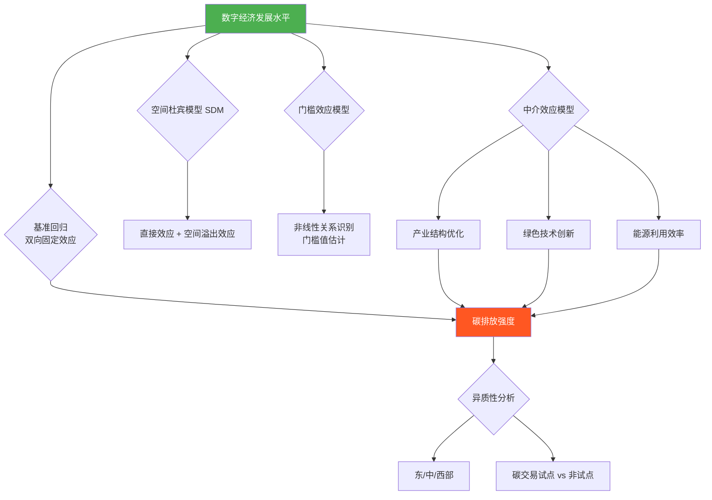

# 参赛计划书：数字经济赋能碳减排的统计建模研究

> **大赛名称：** 第十二届全国大学生统计建模大赛
> **大赛主题：** "服务国家战略 创新统计赋能"
> **拟定论文题目：** 《数字经济对区域碳排放强度的影响研究——基于空间杜宾模型与门槛效应的实证分析》

---

## 一、选题背景与研究意义

### 1.1 现实背景

中国已明确提出"2030年前碳达峰、2060年前碳中和"的双碳目标，这是关系中华民族永续发展的重大战略决策。与此同时，数字经济正成为推动经济高质量发展的核心引擎——2025年中国数字经济规模已超过55万亿元，占GDP比重超过40%。

**核心问题：** 数字经济的快速发展是否能够有效助力碳减排？其作用机制如何？在不同发展水平的地区，效果是否存在差异？

### 1.2 研究意义

| 维度 | 具体意义 |
|------|---------|
| **理论意义** | 将数字经济纳入经典STIRPAT碳排放分析框架，拓展环境库兹涅茨曲线(EKC)理论 |
| **方法创新** | 综合运用空间杜宾模型(SDM) + 门槛效应模型，揭示非线性关系与空间溢出效应 |
| **政策价值** | 为"双碳"目标下精准制定区域差异化数字化减碳政策提供数据决策支撑 |

### 1.3 契合大赛主题

- **"服务国家战略"**：直接对接"双碳"目标 + 数字中国战略
- **"创新统计赋能"**：运用前沿空间统计方法，为政策制定提供量化依据

---

## 二、研究问题与假设

### 2.1 核心研究问题

```
RQ1: 数字经济发展是否显著降低了区域碳排放强度？
RQ2: 数字经济的碳减排效应是否存在空间溢出效应（带动周边区域减碳）？
RQ3: 数字经济的碳减排效应是否存在门槛特征（非线性）？
RQ4: 数字经济通过何种路径（产业结构优化？技术创新？能源效率？）影响碳排放？
```

### 2.2 研究假设

| 编号 | 假设内容 |
|------|---------|
| **H1** | 数字经济发展显著降低区域碳排放强度 |
| **H2** | 数字经济对碳排放强度的影响存在空间正向溢出效应（带动邻近区域减碳） |
| **H3** | 数字经济与碳排放强度间存在非线性关系（倒U型或门槛效应）：初期数字基建消耗能源增加碳排，跨越门槛后效率提升主导减碳 |
| **H3a** | 该门槛效应受经济发展水平的调节 |
| **H4a** | 数字经济通过**产业结构优化**（中介路径一）降低碳排放强度 |
| **H4b** | 数字经济通过**绿色技术创新**（中介路径二）降低碳排放强度 |
| **H4c** | 数字经济通过**能源利用效率提升**（中介路径三）降低碳排放强度 |

---

## 三、研究方法与模型框架

### 3.1 总体研究框架



### 3.2 模型设定

#### 模型一：基准回归（双向固定效应模型）

$$CO2_{it} = \alpha_0 + \alpha_1 DE_{it} + \alpha_2 DE_{it}^2 + \gamma X_{it} + \mu_i + \delta_t + \varepsilon_{it}$$

- $CO2_{it}$：省份 $i$ 在年份 $t$ 的碳排放强度（碳排放总量/GDP）
- $DE_{it}$：数字经济综合发展指数
- $DE_{it}^2$：二次项（检验倒U型关系）
- $X_{it}$：控制变量向量
- $\mu_i$：省份固定效应
- $\delta_t$：时间固定效应

#### 模型二：空间杜宾模型（SDM）

$$CO2_{it} = \rho W \cdot CO2_{it} + \beta_1 DE_{it} + \theta_1 W \cdot DE_{it} + \gamma X_{it} + \theta_2 W \cdot X_{it} + \mu_i + \delta_t + \varepsilon_{it}$$

- $W$：空间权重矩阵（地理距离矩阵 / 经济地理嵌套矩阵）
- $\rho$：空间自回归系数
- $\theta_1$：数字经济的空间溢出系数

#### 模型三：门槛效应模型（Hansen面板门槛）

$$CO2_{it} = \beta_1 DE_{it} \cdot I(q_{it} \leq \gamma_1) + \beta_2 DE_{it} \cdot I(q_{it} > \gamma_1) + \delta X_{it} + \mu_i + \varepsilon_{it}$$

- $q_{it}$：门槛变量（人均GDP / 城镇化率）
- $\gamma_1$：待估计的门槛值
- $I(\cdot)$：指示函数

#### 模型四：中介效应模型（三步法）

```
第一步: CO2 = c * DE + Controls + e1        （总效应）
第二步: M   = a * DE + Controls + e2        （DE → 中介变量）
第三步: CO2 = c' * DE + b * M + Controls + e3  （直接效应 + 间接效应）

中介变量 M: 产业结构高级化 / 绿色专利数 / 单位GDP能耗
```

### 3.3 稳健性检验方案

| 检验方法 | 具体操作 |
|---------|---------|
| **替换因变量** | 用人均碳排放替代碳排放强度 |
| **替换核心自变量** | 使用不同方法构建数字经济指数（PCA vs 熵权法） |
| **内生性处理** | 使用工具变量法（IV）：各省1984年固定电话数量作为数字经济的工具变量 |
| **动态面板** | 系统GMM估计，加入被解释变量滞后项 |
| **替换空间权重矩阵** | 从地理邻接矩阵更换为经济距离矩阵 |
| **缩尾处理** | 对所有连续变量进行1%和99%的缩尾处理 |
| **排除直辖市** | 剔除北京、天津、上海、重庆重新估计 |

---

## 四、数据来源与变量设计

### 4.1 数据范围

- **空间范围**：中国30个省级行政区（除港澳台及西藏）
- **时间范围**：2011-2023年（13年面板数据，共390个观测值）

### 4.2 变量定义与数据来源

#### 因变量

| 变量 | 定义 | 数据来源 |
|------|------|---------|
| **碳排放强度 (CI)** | CO2排放总量 / GDP（吨/万元） | CEADs碳核算数据库 (ceads.net.cn) |
| 人均碳排放（稳健性） | CO2排放总量 / 常住人口 | CEADs + 国家统计局 |

#### 核心自变量

| 变量 | 构建方法 | 数据来源 |
|------|---------|---------|
| **数字经济综合指数 (DE)** | 熵权法构建，包含4个一级指标、12个二级指标 | 多源数据整合（详见下表） |

**数字经济综合指数构建体系：**

| 一级指标 | 二级指标 | 数据来源 |
|---------|---------|---------|
| 数字基础设施 | 互联网普及率、移动电话普及率、光缆线路长度 | 中国统计年鉴 |
| 数字产业发展 | 电信业务总量、信息技术服务收入、软件业务收入 | 工信部统计公报 |
| 数字金融发展 | 数字普惠金融指数（覆盖广度、使用深度、数字化程度） | 北京大学数字金融研究中心 |
| 数字创新能力 | 数字技术专利申请数、R&D人员密度、技术市场成交额 | 国家知识产权局、科技统计年鉴 |

#### 控制变量

| 变量 | 定义 | 预期符号 | 数据来源 |
|------|------|---------|---------|
| 经济发展水平 (PGDP) | 人均GDP（取对数） | +/- | 国家统计局 |
| 产业结构 (IS) | 第二产业增加值/GDP | + | 国家统计局 |
| 城镇化水平 (URB) | 城镇常住人口比例 | +/- | 各省统计年鉴 |
| 对外开放 (FDI) | 实际利用外资/GDP | - | 商务部 |
| 环境规制 (ER) | 环境污染治理投资/GDP | - | 中国环境统计年鉴 |
| 能源消费结构 (ES) | 煤炭消费量/一次能源消费总量 | + | 中国能源统计年鉴 |

#### 中介变量

| 变量 | 定义 | 数据来源 |
|------|------|---------|
| 产业结构高级化 (ISU) | 第三产业/第二产业增加值之比 | 国家统计局 |
| 绿色技术创新 (GTI) | 绿色专利申请数（取对数） | 国家知识产权局（CNIPA） |
| 能源利用效率 (EE) | GDP/能源消费总量 | 中国能源统计年鉴 |

---

## 五、技术路线与时间安排

### 5.1 技术路线图


### 5.2 时间安排（倒推法，以校赛5月初截止为基准）

| 阶段 | 时间 | 任务内容 | 负责人建议 |
|------|------|---------|-----------|
| **第一阶段：准备** | 3/30 - 4/5（7天） | 文献精读20篇以上；确定最终变量体系；数据收集与清洗 | 全员 |
| **第二阶段：建模** | 4/6 - 4/15（10天） | 构建数字经济指数；基准回归；空间计量分析；门槛效应 | 建模组 |
| **第三阶段：深化** | 4/16 - 4/22（7天） | 中介效应分析；异质性分析；稳健性检验矩阵 | 建模组 |
| **第四阶段：论文** | 4/23 - 4/28（6天） | 论文初稿撰写（严控16000字以内）；图表规范化 | 写作组 |
| **第五阶段：打磨** | 4/29 - 5/3（5天） | 知网查重（控制在20%以下）；反复修改润色；准备附件材料 | 全员 |

> [!WARNING]
> **关键节点提醒**：请务必在4月中旬前确认校赛截止日期，部分学校可能提前至4月底！

---

## 六、论文大纲（预计结构）

```
标题：数字经济对区域碳排放强度的影响研究
      ——基于空间杜宾模型与门槛效应的实证分析

摘要（约300字）
关键词：数字经济；碳排放强度；空间杜宾模型；门槛效应；双碳目标

1  引言（约1500字）
   1.1 研究背景
   1.2 研究意义
   1.3 研究贡献与创新点

2  文献综述与理论分析（约2000字）
   2.1 数字经济与碳排放的关系
   2.2 碳排放的空间溢出效应
   2.3 理论分析与研究假设

3  研究设计（约2500字）
   3.1 模型构建
       3.1.1 基准回归模型
       3.1.2 空间杜宾模型
       3.1.3 门槛效应模型
       3.1.4 中介效应模型
   3.2 变量选取与数据来源
   3.3 数字经济综合指数构建

4  实证分析（约5000字）
   4.1 描述性统计与相关性分析
   4.2 基准回归结果
   4.3 空间效应分析
       4.3.1 空间自相关检验（Moran's I）
       4.3.2 空间杜宾模型估计结果
       4.3.3 直接效应与间接效应分解
   4.4 门槛效应分析
       4.4.1 门槛存在性检验
       4.4.2 门槛值估计与分区间分析
   4.5 影响机制分析（中介效应）

5  进一步讨论（约2500字）
   5.1 异质性分析（东/中/西部、碳交易试点）
   5.2 稳健性检验
   5.3 内生性处理

6  结论与政策建议（约1500字）
   6.1 主要结论
   6.2 政策建议
   6.3 研究局限与展望

参考文献
附录：数据说明与补充表格

                               合计 约 15,000 字（预留1000字余量）
```

---

## 七、预期创新点

1. **视角创新**：将"数字经济"与"双碳"两大国家战略交叉融合，聚焦数字技术的绿色赋能价值
2. **方法创新**：综合运用 SDM + 门槛效应 + 中介效应的"三位一体"建模框架，同时揭示空间维度、非线性特征和作用机制
3. **数据创新**：基于熵权法自行构建多维数字经济综合指数，而非依赖单一代理变量
4. **政策创新**：通过异质性分析（碳交易试点 vs 非试点），为差异化政策设计提供精准统计依据

---

## 八、所需工具与软件

| 用途 | 软件/工具 | 说明 |
|------|----------|------|
| 数据处理 | Python (pandas, numpy) | 数据清洗、指标计算、缩尾处理 |
| 统计建模 | Stata 17 / R | 面板回归、空间计量、门槛效应 |
| 空间分析 | GeoDa / ArcGIS | 空间自相关检验、空间权重矩阵构建 |
| 指标构建 | Python / MATLAB | 熵权法计算综合指数 |
| 可视化 | Python (matplotlib, seaborn) | 图表绘制 |
| 论文写作 | LaTeX / Word | 论文排版 |
| 查重工具 | 知网查重系统 | 控制重复率在20%以下 |

---

## 九、团队分工建议

| 角色 | 主要职责 | 关键能力要求 |
|------|---------|-------------|
| **队员A（建模主力）** | 模型代码实现、空间计量分析、门槛效应估计 | Stata/R编程、计量经济学基础 |
| **队员B（数据与可视化）** | 数据采集清洗、指标构建、图表制作、描述统计 | Python数据处理、数据可视化 |
| **队员C（写作与统筹）** | 论文撰写、文献综述、逻辑梳理、查重修改、材料整理 | 学术写作、项目管理 |

---

## 十、风险评估与应对

| 潜在风险 | 影响 | 应对方案 |
|---------|------|---------|
| 数据缺失（部分省份年份数据不全） | 影响面板平衡性 | 采用多重插补法或使用非平衡面板；标注缺失情况 |
| 空间自相关不显著 | SDM模型失去基础 | 改用普通面板回归 + 区域虚拟变量交互项 |
| 门槛效应不显著 | 无法验证H3 | 改用非参数方法或分位数回归探索非线性 |
| 查重率超标 | 取消参赛资格 | 提前多轮查重；替换高重复段落的表述方式；避免大段引用 |
| 字数超限（16000字） | 不合规 | 论文大纲阶段即分配好各部分字数；精简文献综述 |
| 内生性问题 | 结论可靠性受质疑 | 预备多种IV策略和GMM方法作为备选 |

---

## 十一、提交材料清单

- [ ] 报名表（按学校要求填写）
- [ ] 承诺书（全体队员签字）
- [ ] AI工具使用情况表（如实填写Python/R等工具使用情况）
- [ ] 论文正文（PDF格式，16000字以内）
- [ ] 知网查重报告（重复率 < 20%）
- [ ] 数据包（原始数据 + 清洗后数据 + 代码脚本）
